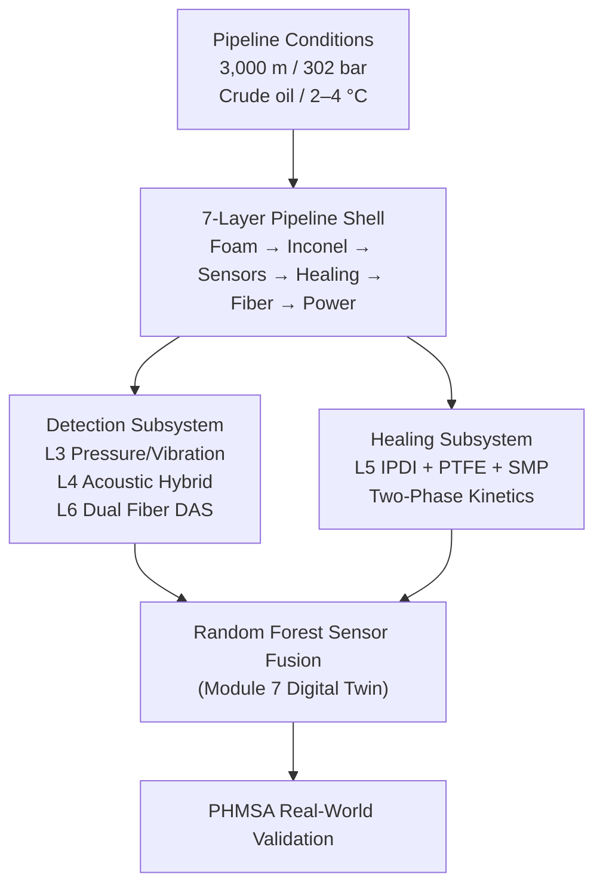

# Deep-Sea Pipeline: Pinhole Leak Detection and Self-Healing Simulation


> A Physics-Grounded Academic Simulation of a 7-Layer Smart Pipeline featuring Pinhole Leak Detection, Multi-Sensor Fusion, Hybrid Self-Healing, Machine Learning Sensor Fusion, and Real-World PHMSA Validation.

This project simulates the complete lifecycle of a deep-sea crude oil pipeline incident: pinhole formation, signal detection across multiple sensing layers, autonomous self-healing, and recovery. It combines fluid mechanics, materials science, acoustic sensing theory, and machine learning into a single literature-grounded simulation, with every material and parameter choice traceable to a published source.

The system models a 7-layer pipeline architecture operating at 3,000 m depth, where a 0.5 mm pinhole leak is detected through pressure, acoustic, and distributed fiber sensing, then autonomously sealed using a three-mechanism hybrid healing system, and finally cross-validated against real PHMSA pipeline incident records.

## Table of Contents

- [Overview](#overview)
- [Key Features](#key-features)
- [Technology Stack](#technology-stack)
- [System Architecture](#system-architecture)
  - [Layer Architecture](#layer-architecture)
- [Why Not DCPD and Grubbs Catalyst](#why-not-dcpd-and-grubbs-catalyst)
- [Operating Conditions](#operating-conditions)
- [Self-Healing Pipeline](#self-healing-pipeline)
  - [Current Workflow](#current-workflow)
  - [Hybrid Healing System Model](#hybrid-healing-system-model)
  - [Two-Phase Simulation Model](#two-phase-simulation-model)
- [Machine Learning Sensor Fusion](#machine-learning-sensor-fusion)
- [Database and Validation Design](#database-and-validation-design)
  - [PHMSA Validation Dataset](#phmsa-validation-dataset)
- [Repository Structure](#repository-structure)
- [Installation](#installation)
  - [Setup](#setup)
  - [Run the Full Simulation](#run-the-full-simulation)
  - [Run Specific Figures](#run-specific-figures)
  - [Skip PHMSA Validation](#skip-phmsa-validation)
- [PHMSA Data Source](#phmsa-data-source)
  - [Source](#source)
  - [File Used](#file-used)
  - [Conversion to CSV](#conversion-to-csv)
  - [Result](#result)
  - [Refreshing](#refreshing)
- [Output Figures](#output-figures)
- [Project Evolution](#project-evolution)
  - [Initial Development](#initial-development)
  - [Detection Modeling](#detection-modeling)
  - [Self-Healing System](#self-healing-system)
  - [Machine Learning Integration](#machine-learning-integration)
  - [Real-World Validation](#real-world-validation)
- [Notable Milestones](#notable-milestones)
- [Research Applications](#research-applications)
- [References](#references)

## Overview

This simulation was designed to explore how a multi-layer deep-sea pipeline can detect and respond to a sub-millimeter pinhole leak that is otherwise invisible to conventional flow and pressure monitoring. It demonstrates a practical, literature-backed implementation of:

* Deep-Sea Pipeline Physics (pressure, flow, friction)
* Pinhole Leak Detection Below the Sensor Noise Floor
* Multi-Sensor Fusion (Pressure, Acoustic, Distributed Fiber)
* Three-Mechanism Hybrid Self-Healing
* Random Forest Machine Learning Sensor Fusion
* Energy Harvesting and Autonomous Power Management
* Real-World Validation Against PHMSA Incident Data

The project serves as both an academic design simulation and a research platform for studying multi-layer sensing, materials selection, and reinforcement-style adaptive monitoring in extreme environments.

## Key Features

### Pipeline Physics

* Hydrostatic and Internal Pressure Modeling
* Blasius Turbulent Friction Factor
* ISO 5167 Orifice Discharge Flow
* Reynolds Number and Flow Regime Calculation

### Leak Detection

* Pressure Profile and Flow Rate Degradation Modeling
* Sensor Noise Simulation (Gaussian and Tidal Components)
* Quartz and Hydrophone Hybrid Acoustic Detection
* Strouhal Orifice Tone Calculation
* Dual Redundant Fiber Optic Distributed Acoustic Sensing (DAS)

### Self-Healing System

* IPDI@SPUA Chemical Capsule Sealing
* PTFE Pressurized Vascular Network
* Shape Memory Polymer Mechanical Crack Closure
* Two-Phase Healing Kinetics Model

### Machine Learning Sensor Fusion

* Random Forest Classifier Trained on Monte Carlo Scenarios
* Logistic Regression Baseline Comparison
* Stratified 10-Fold Cross-Validation
* Permutation Feature Importance
* Probability Calibration and Brier Score
* Full Incident Lifecycle Decision Timeline

### Power System

* Piezoelectric Energy Harvesting
* Thermoelectric Generator (Seawater-Oil Gradient)
* Li-Thionyl Backup Battery Modeling
* Sapphire Optical Window Transmittance vs Depth

### Validation

* Cross-Validation Against PHMSA Hazardous Liquid Incident Database
* Pressure, Diameter, and Volume Loss Percentile Benchmarking
* IEEE-Style Validation Summary Report

## Technology Stack

| Layer                   | Technology                              |
| ------------------------ | ---------------------------------------- |
| Programming Language     | Python 3                                 |
| Numerical Computing      | NumPy                                    |
| Data Handling            | Pandas                                   |
| Statistical Modeling     | SciPy (stats)                            |
| Machine Learning         | scikit-learn (Random Forest, Logistic Regression) |
| Visualization            | Matplotlib                               |
| Validation Dataset       | PHMSA Hazardous Liquid Incident Database |
| Execution Interface      | Command-Line (argparse)                  |
| Version Control          | Git & GitHub                             |

## System Architecture



### Layer Architecture

| Layer | Material / Technology                  | Main Function                       | Survival Rate |
| ----- | --------------------------------------- | ------------------------------------ | -------------- |
| 1     | UE44/TMA Syntactic Foam + Basalt Fiber  | Pressure damping, buoyancy, insulation | 97-98%        |
| 2     | Inconel 625 Structural Shell            | Structural strength, corrosion resistance | 99%        |
| 3     | PMN-PT + Floating Ceramic Shock Mount   | Pressure and vibration sensing       | 99%            |
| 4     | Quartz + Hydrophone Hybrid              | Acoustic crack and leak detection    | 98%            |
| 5     | Hybrid Healing System                   | Self-healing crack repair            | 99%            |
| 6     | Dual Redundant Fiber Optics             | Data communication and monitoring    | 98%            |
| 7     | Hybrid Power Layer                      | Energy harvesting and backup power   | 98-99%         |

Construction proceeds outside to inside in four steps: Environmental Shielding (Layer 1), Structural Backbone and Senses (Layers 2-3), Internal Protection and Self-Repair (Layers 4-5), and Central Core and Intelligence (Layers 6-7).

## Why Not DCPD and Grubbs Catalyst

The classic White et al. (2001) DCPD plus Grubbs catalyst self-healing system is not used in this simulation, for reasons grounded in subsequent literature:

* Grubbs catalyst is deactivated by seawater moisture and chloride ions, and endo-DCPD sits near its melting point at deep-sea temperatures, preventing the ring-opening polymerization from completing (Mauldin et al., 2007).
* Saline conditions reduce polymerization rate by approximately 60 percent relative to lab conditions (Afrinaldi et al., 2023).
* Deep-sea pressure causes premature capsule rupture in the original formulation (Zeng et al., 2025).

Instead, Layer 5 uses an IPDI (isocyanate) and FBE (Fusion Bonded Epoxy) system, where IPDI reacts with seawater itself as a co-reactant to form polyurea, FBE cures reliably at 4 degrees Celsius, and the combination has been validated at 150 bar immersion for over 1,000 hours.

## Operating Conditions

| Parameter         | Value                  |
| ------------------ | ----------------------- |
| Depth              | 3,000 m                 |
| External Pressure  | Approximately 302 bar   |
| Temperature        | 2-4 degrees Celsius     |
| Fluid              | Crude oil (850 kg/m3)   |
| Pipeline           | 50 km length, 0.5 m diameter |
| Internal Pressure  | 100-150 bar              |
| Pinhole            | 0.5 mm diameter at 20 km from inlet |

## Self-Healing Pipeline

### Current Workflow

1. Pinhole forms at a point along the pipeline under internal pressure.
2. Pressure and flow signals degrade by a fraction of a percent, well below the sensor noise floor.
3. Layer 3 PMN-PT sensors continuously monitor bulk wall pressure and vibration.
4. Layer 4 Quartz and Hydrophone Hybrid sensors detect the orifice acoustic tone.
5. Layer 6 Dual Redundant Fiber DAS detects distributed vibration along the pipeline.
6. A Random Forest sensor fusion model combines all signals into a leak probability estimate.
7. Layer 5 Hybrid Healing System activates: IPDI@SPUA capsules seal the crack chemically within seconds.
8. PTFE vascular network and shape memory polymer matrix consolidate the seal over several minutes.
9. Pressure and flow signals recover to baseline.
10. The incident is logged and benchmarked against real-world PHMSA pipeline data.

## Hybrid Healing System Model

Layer 5 combines three complementary repair mechanisms.

Mechanism A, IPDI@SPUA chemical capsules, ruptures under deep-sea pressure and reacts with seawater to form polyurea, contributing 55-75 percent sealing efficiency on its own.

Mechanism B, a pressurized PTFE vascular network, delivers sealing fluid continuously over a longer time window, governed by a vascular rate constant of 0.05 per minute.

Mechanism C, a shape memory polymer matrix, mechanically closes microcracks through elastic recovery driven by the temperature difference between crude oil and seawater, adding 5-10 percent efficiency.

Combined, the hybrid system reaches 60-80 percent healing efficiency in realistic deep-sea conditions.

### Two-Phase Simulation Model

```text
Phase 1 (0-60 s)   IPDI@SPUA + SMP sealing
cf(t) = 1 - eta * (1 - exp(-(t - t_onset) / tau_fill))

Phase 2 (60 s - 10 min)   PTFE vascular + SMP recovery
cf(t) = A0 * exp(-k * (t - 60) / 60),  k = 0.05 / min
```

## Machine Learning Sensor Fusion

A Random Forest classifier fuses fifteen features drawn from Layers 3, 4, and 6 (pressure statistics, acoustic FFT features, and distributed acoustic sensing spatial features) into a single leak probability. The model is evaluated using stratified 10-fold cross-validation, compared against a Logistic Regression baseline, and assessed with permutation importance and calibration analysis rather than relying on a single train-test split. A full incident-lifecycle decision timeline traces the predicted leak probability from normal operation through leak onset, detection, healing, and recovery.

## Database and Validation Design

### PHMSA Validation Dataset

| Column                       | Description                       |
| ------------------------------ | ----------------------------------- |
| LEAK_TYPE                      | Type of pipeline failure (e.g. pinhole) |
| COMMODITY_RELEASED_TYPE        | Substance released                |
| ACCIDENT_PSIG                  | Operating pressure at incident    |
| PIPE_DIAMETER                  | Pipe diameter in inches           |
| UNINTENTIONAL_RELEASE_BBLS     | Volume released, in barrels       |
| EST_COST_ENVIRONMENTAL         | Estimated environmental cost      |
| EST_COST_PROP_DAMAGE           | Estimated property damage cost    |
| ON_OFF_SHORE                   | Offshore or onshore classification |
| IYEAR                          | Incident year                     |

Simulation parameters (pipe diameter, operating pressure, pinhole prevalence, and volume loss with and without healing) are benchmarked against this dataset's empirical distribution to confirm the simulation sits within realistic real-world ranges.

## Repository Structure

```text
deep-sea-pipeline-pinhole-leak-and-self-healing-simulation/
│
├── src/
│   ├── __init__.py
│   ├── cli.py
│   ├── config.py
│   ├── domain/
│   │   ├── __init__.py
│   │   ├── layer_architecture.py
│   │   ├── pipeline_physics.py
│   │   ├── leak_simulator.py
│   │   ├── sensor_system.py
│   │   ├── healing_system.py
│   │   └── power_system.py
│   ├── ml/
│   │   ├── __init__.py
│   │   └── sensor_fusion.py
│   ├── validation/
│   │   ├── __init__.py
│   │   └── phmsa_data.py
│   └── plotting/
│       ├── __init__.py
│       ├── utils.py
│       ├── fig01_pressure_flow.py
│       ├── fig02_sensor_signals.py
│       ├── fig03_healing_response.py
│       ├── fig04_cross_section.py
│       ├── fig05_intelligence_layer.py
│       ├── fig06_structural_environment.py
│       ├── fig07_performance_summary.py
│       ├── fig08_phmsa_landscape.py
│       ├── fig09_quantitative_validation.py
│       ├── fig10_ieee_validation_dashboard.py
│       └── fig11_ml_sensor_fusion.py
├── .gitignore
├── main.py
├── phmsa.csv
├── requirements.txt
└── README.md
```

The `src` package is organized by responsibility: `domain/` holds the seven-layer physics and architecture classes (Modules 1-6), `ml/` holds the Random Forest sensor fusion digital twin (Module 7), `validation/` holds PHMSA data loading and the IEEE-style report, and `plotting/` holds one module per output figure. `config.py` centralizes shared paths and the color theme, and `cli.py` wires everything together behind the `main()` entry point.

Note: the simulation reads `phmsa.csv` from the current working directory at runtime (`PHMSA_PATH = os.path.join(os.getcwd(), "phmsa.csv")`). This file should be kept at the repository root alongside `main.py`, not inside `src/`, since the script is intended to be run from the project root.

## Installation

### Setup

```bash
cd deep-sea-pipeline-pinhole-leak-and-self-healing-simulation

pip install -r requirements.txt
```

### Run the Full Simulation

```bash
python main.py
```

This generates all 11 figures and saves them to the `outputs/` directory.

### Run Specific Figures

```bash
python main.py --figs 1 2 3
```

### Skip PHMSA Validation

```bash
python main.py --no-phmsa
```

PHMSA validation figures (8, 9, and 10) require `phmsa.csv` to be present at the project root. If the file is missing, the script will print a download link and skip those figures automatically.

## PHMSA Data Source

This section records exactly where `phmsa.csv` comes from and how it was produced, so the dataset can be refreshed or audited later without guesswork.

### Source

**PHMSA Distribution, Transmission, Gathering, LNG, and Liquid Accident and Incident Data:**
https://www.phmsa.dot.gov/data-and-statistics/pipeline/distribution-transmission-gathering-lng-and-liquid-accident-and-incident-data

PHMSA publishes hazardous liquid pipeline accident data as a set of era-specific downloads, since the incident report form (RSPA/PHMSA Form F 7000-1) has been revised several times since the 1970s and each revision changed the data fields collected.

### File Used

| Era | Used? | Reason |
| ----- | ----- | ----- |
| Pre 1986 | No | Different, minimal field set; no leak-type or onshore/offshore classification |
| 1986 – Jan 2002 | No | Different, minimal field set; no leak-type classification of any kind |
| Jan 2002 – Dec 2009 | No | Partial field overlap, but leak-type, pressure, and diameter are recorded for well under half of incidents, and cost fields do not exist in this era's form at all |
| **Jan 2010 – Present** | **Yes** | Identical schema (648 columns) to `phmsa.csv`; every column the simulation depends on is present and populated |

**File:** `accident_hazardous_liquid_jan2010_present.txt`, from the "Jan 2010–Present" download on the page above.

Format as downloaded:
* Tab-delimited (`\t`)
* ISO-8859-1 (Latin-1) encoding
* CRLF line endings
* 648 columns, header row included

### Conversion to CSV

The only transformation applied is a format conversion — tab-delimited/Latin-1 to comma-delimited/UTF-8. No rows are filtered, no columns are dropped or renamed, and no cell values are edited. This was confirmed by comparing the converted output against the previous `phmsa.csv` cell-by-cell: every row present in both files matched exactly, aside from a small number of cells (~0.03%) reflecting genuine PHMSA updates — investigations closing (`REPORT_TYPE` moving from `SUPPLEMENTAL` to `SUPPLEMENTAL FINAL`), causes being finalized, and cost estimates being revised.

#### Script

```python
import pandas as pd

RAW_PATH = "accident_hazardous_liquid_jan2010_present.txt"
OUTPUT_PATH = "phmsa.csv"

# Read the raw PHMSA download: tab-delimited, Latin-1 encoded
df = pd.read_csv(RAW_PATH, sep="\t", encoding="latin-1", low_memory=False)

# Write out as standard comma-delimited UTF-8 CSV
# No filtering, no column changes, no value edits
df.to_csv(OUTPUT_PATH, index=False, encoding="utf-8")

print(f"Rows: {len(df)}  |  Columns: {len(df.columns)}")
```

Run from the directory containing the downloaded `.txt` file:

```bash
python convert_phmsa.py
```

### Result

| | Rows | Columns | Years covered |
| ----- | ----- | ----- | ----- |
| Current `phmsa.csv` | 5,959 | 648 | 2010–2026 |

### Refreshing

PHMSA updates this dataset on an ongoing basis as incident investigations are filed, amended, and closed. To refresh:

1. Download the current "Jan 2010–Present" file from the source link above.
2. Run the script in the Script subsection above against it.
3. Replace `phmsa.csv` at the project root with the new output.

No changes to the simulation code are required — `phmsa.csv` is read at runtime from `PHMSA_PATH = os.path.join(os.getcwd(), "phmsa.csv")`, so any correctly formatted replacement file works as-is.

## Output Figures

| Figure | Content                                              |
| ------ | ------------------------------------------------------ |
| 1      | Pressure profile and flow rate, showing the leak signal buried in sensor noise |
| 2      | Layer 3, 4, and 6 sensor signal comparison across three pipeline states |
| 3      | Layer 5 hybrid self-healing response over time         |
| 4      | Seven-layer cross-section schematic                    |
| 5      | Dual fiber redundancy and Layer 7 power system          |
| 6      | Structural and environmental property validation        |
| 7      | Performance summary dashboard                           |
| 8      | PHMSA real-world incident landscape                      |
| 9      | Quantitative validation against PHMSA data               |
| 10     | IEEE-style validation summary dashboard                  |
| 11     | Random Forest sensor fusion and digital twin intelligence |

## Project Evolution

### Initial Development

* Pipeline Physics Parameters and Geometry
* Pressure and Flow Equations (Blasius, ISO 5167)
* Layer Architecture Definition

### Detection Modeling

* Sensor Noise Simulation
* Quartz and Hydrophone Hybrid Acoustic Modeling
* Dual Redundant Fiber DAS Modeling

### Self-Healing System

* Initial Single-Agent DCPD Model (deprecated)
* Literature Review of Deep-Sea Healing Failure Modes
* Hybrid IPDI, PTFE, and SMP Three-Mechanism Model

### Machine Learning Integration

* Monte Carlo Scenario Generation
* Random Forest and Logistic Regression Training
* Cross-Validation and Calibration Analysis
* Full Incident Lifecycle Decision Timeline

### Real-World Validation

* PHMSA Dataset Integration
* Percentile Benchmarking of Simulation Parameters
* IEEE-Style Validation Report Generation

## Notable Milestones

* Full Seven-Layer Pipeline Architecture Simulation
* Literature-Grounded Healing Agent Replacement (DCPD to IPDI)
* Multi-Sensor Fusion Across Pressure, Acoustic, and Fiber Modalities
* Random Forest Digital Twin for Leak Probability Estimation
* Cross-Validation Against 5,890 Real PHMSA Pipeline Incidents
* Automated Figure Generation Pipeline (11 Figures)

## Research Applications

This project can be used to study:

* Deep-Sea Pipeline Engineering
* Multi-Sensor Fusion for Structural Health Monitoring
* Self-Healing Materials Under Extreme Pressure
* Machine Learning for Predictive Maintenance
* Reliability Engineering and System Survival Modeling
* Validation of Simulation Models Against Empirical Incident Data

## References

Every material choice, healing agent, sensing principle, and physical constant in this simulation is grounded in a cited source. The full 41-reference bibliography, as used in the accompanying manuscript, is reproduced below, with a note on where each source is used in the codebase. Every entry has been individually verified against the publisher record (title, authors, journal, and DOI); three items (data source and one industry technical bulletin, plus one paper with no formal DOI) are noted accordingly rather than assigned a DOI.

1. Pipeline and Hazardous Materials Safety Administration. Pipeline incident data and hazardous liquid accident statistics. U.S. Department of Transportation. Available: https://www.phmsa.dot.gov/data-and-statistics/pipeline/distribution-transmission-gathering-lng-and-liquid-accident-and-incident-data. The real-world validation dataset underlying the PHMSA cross-validation in `src/validation/`, benchmarking simulated operating pressure, pipe diameter, leak-type frequency, and volume loss against empirical incident records (Figures 8-10). No DOI (government dataset).

2. Wenz, G. M. (1962). Acoustic ambient noise in the ocean: Spectra and sources. *Journal of the Acoustical Society of America*, 34(12), 1936-1956. doi: 10.1121/1.1909155. Source of the ocean ambient noise floor used to calibrate hydrophone and DAS noise in Layer 4 and Layer 6; the Strouhal leak tone is superimposed on this noise model.

3. Bakhtawar, B. and Zayed, T. (2021). Review of water leak detection and localization methods through hydrophone technology. *Journal of Pipeline Systems Engineering and Practice*, 12(4), 03121002. doi: 10.1061/(ASCE)PS.1949-1204.0000574. Motivates the acoustic/hydrophone detection principle used in Layer 4 - that an escaping leak radiates a detectable pressure wave.

4. Fan, H., Tariq, S., and Zayed, T. (2022). Acoustic leak detection approaches for water pipelines. *Automation in Construction*, 138, 104226. doi: 10.1016/j.autcon.2022.104226. Supports the Layer 6 distributed acoustic sensing (DAS) Gaussian spatial-bump model used to simulate a leak signature along the fiber.

5. Lopez-Higuera, J. M., Cobo, L. R., Incera, A. Q., and Cobo, A. (2011). Fiber optic sensors in structural health monitoring. *Journal of Lightwave Technology*, 29(4), 587-608. doi: 10.1109/JLT.2011.2106479. General basis for the Layer 6 distributed fiber-optic sensing concept (strain/vibration/backscatter perturbation mapping).

6. Xenaki, A., Gerstoft, P., Williams, E., and Abadi, S. (2025). Overview of distributed acoustic sensing: Theory and ocean applications. *Journal of the Acoustical Society of America*, 158(1), 801-825. doi: 10.1121/10.0037218. Basis for extending Layer 6 fiber sensing to continuous, cable-length ocean monitoring (DAS).

7. Lu, X. et al. (2025). Superior toughness-strength epoxy via biocomposite curing for deep-sea equipment using multifunctional syntactic foams. *ACS Applied Polymer Materials*. doi: 10.1021/acsapm.5c02794. Material basis for the Layer 1 UE44/TMA syntactic foam formulation.

8. Anirudh, S., Jayalakshmi, C. G., Anand, A., Kandasubramanian, B., and Ismail, S. O. (2022). Epoxy/hollow glass microsphere syntactic foams for structural and functional application - A review. *European Polymer Journal*, 171, 111163. doi: 10.1016/j.eurpolymj.2022.111163. Supports the Layer 1 design choice of hollow-microsphere-filled epoxy for density reduction while retaining pressure resistance.

9. Loubrieu, G. et al. (2022). Hydrostatic strength of hollow glass microspheres composites: Influencing factors and modelling. *Composites Part C: Open Access*, 8, 100286. doi: 10.1016/j.jcomc.2022.100286. Source for the Layer 1 hydrostatic pressure-vs-depth margin model (`fig06_structural_environment.py`).

10. Smith, M. J. A., Yousaf, Z., Potluri, P., and Parnell, W. J. (2021). Modelling hollow thermoplastic syntactic foams under high-strain compressive loading. *Composites Science and Technology*, 213, 108882. doi: 10.1016/j.compscitech.2021.108882. Structural modelling reference for Layer 1 syntactic foam under compressive loading.

11. Yousaf, Z., Morrison, N. F., and Parnell, W. J. (2022). Tensile properties of all-polymeric syntactic foam composites: Experimental characterization and mathematical modelling. *Composites Part B: Engineering*, 231, 109556. doi: 10.1016/j.compositesb.2021.109556. Additional Layer 1 material-property reference for the syntactic foam formulation.

12. Selcuk, S., Ahmetoglu, U., and Gokce, E. C. (2023). Basalt fiber reinforced polymer composites (BFRP) other than rebars: A review. *Materials Today Communications*, 37, 107359. doi: 10.1016/j.mtcomm.2023.107359. Basis for the Layer 1 basalt-fiber crack-bridging network layered into the syntactic foam.

13. Deng, X., Hoo, M. S., Cheah, Y. W., and Tran, L. Q. N. (2022). Processing and mechanical properties of basalt fibre-reinforced thermoplastic composites. *Polymers*, 14(6), 1220. doi: 10.3390/polym14061220. Supports the mechanical-property assumptions for the Layer 1 basalt-fiber reinforcement.

14. Huang, L., Gong, S., Li, G., Li, S., Tang, K., and Wang, W. (2025). Mechanical properties and tensile intrinsic study of basalt fibre-silicon carbide (SiC) co-reinforced polyurethane cement mortar. *Materials & Design*, 261, 115299. doi: 10.1016/j.matdes.2025.115299. Additional basalt-fiber composite reference supporting Layer 1 material selection.

15. Fiore, V., Scalici, T., Di Bella, G., and Valenza, A. (2015). A review on basalt fibre and its composites. *Composites Part B: Engineering*, 74, 74-94. doi: 10.1016/j.compositesb.2014.12.034. General basalt-fiber composites reference underpinning the Layer 1 crack-bridging design.

16. Special Metals Corporation (2013). INCONEL alloy 625. Technical Bulletin. Source of the Layer 2 structural-shell material specification: the 350 bar pressure rating and chloride-stress-corrosion resistance used in `pipeline_physics.py`. No DOI (manufacturer technical bulletin, not a journal article).

17. Zhang, S., Li, F., Luo, J., Sahul, R., and Shrout, T. R. (2013). Relaxor-PbTiO3 single crystals for various applications. *IEEE Transactions on Ultrasonics, Ferroelectrics, and Frequency Control*, 60(8), 1572-1580. doi: 10.1109/TUFFC.2013.2737. Basis for the Layer 3 PMN-PT relaxor single-crystal pressure/vibration sensor.

18. Tian, J. and Han, P. (2014). Growth and characterization on PMN-PT-based single crystals. *Crystals*, 4(3), 331-341. doi: 10.3390/cryst4030331. Additional material-characterization reference for the Layer 3 PMN-PT sensing element.

19. Ju, M., Dou, Z., Li, J.-W., Qiu, X., Shen, B., Zhang, D., Yao, F.-Z., Gong, W., and Wang, K. (2023). Piezoelectric materials and sensors for structural health monitoring: Fundamental aspects, current status, and future perspectives. *Sensors*, 23(1), 543. doi: 10.3390/s23010543. General piezoelectric-sensing reference supporting the Layer 3 pressure/vibration sensing design.

20. Abdul, B., Mastronardi, V. M., Qualtieri, A., Algieri, L., Guido, F., Rizzi, F., and De Vittorio, M. (2020). Sensitivity and directivity analysis of piezoelectric ultrasonic cantilever-based MEMS hydrophone for underwater applications. *Journal of Marine Science and Engineering*, 8(10), 784. doi: 10.3390/jmse8100784. Basis for the Layer 4 MEMS hydrophone element in the quartz + hydrophone hybrid sensor.

21. Shi, S., Geng, W., He, J., Hou, X., Mu, J., Li, J. F., and Chou, X. (2020). Design and fabrication of a novel MEMS piezoelectric hydrophone. *Sensors and Actuators A: Physical*, 313, 112203. doi: 10.1016/j.sna.2020.112203. Additional MEMS hydrophone design reference for Layer 4.

22. Choi, S., Lee, H., and Moon, W. (2010). A micro-machined piezoelectric hydrophone with hydrostatically balanced air backing. *Sensors and Actuators A: Physical*, 158, 60-71. doi: 10.1016/j.sna.2009.12.019. Supports the hydrostatic-balancing approach used in the Layer 4 hydrophone model.

23. Wang, W., Pei, Y., Ye, L., and Song, K. (2020). High-sensitivity cuboid interferometric fiber-optic hydrophone based on planar rectangular film sensing. *Sensors*, 20(22), 6422. doi: 10.3390/s20226422. Fiber-optic hydrophone reference contributing to the Layer 4 quartz + hydrophone hybrid sensing design.

24. White, S. R. et al. (2001). Autonomic healing of polymer composites. *Nature*, 409, 794-797. doi: 10.1038/35057232. The original microcapsule self-healing concept under lab (dry) conditions; used in the manuscript as the baseline benchmark that the Layer 5 hybrid system improves upon for deep-sea use.

25. Toohey, K. S., Sottos, N. R., Lewis, J. A., Moore, J. S., and White, S. R. (2007). Self-healing materials with microvascular networks. *Nature Materials*, 6, 581-585. doi: 10.1038/nmat1934. Source of the vascular-network rate constant (k = 0.05 per minute) used in the Layer 5 Phase 2 (PTFE-vascular) healing model in `healing_system.py`.

26. Paladugu, S. R. M. et al. (2022). A comprehensive review of self-healing polymer, metal, and ceramic matrix composites and their applications. *Materials*, 15(23), 8521. doi: 10.3390/ma15238521. Supports the manuscript's motivation for a hybrid, multi-mechanism healing approach ("no single chemistry covers all damage rates well").

27. Adil, M. M., Rabbi, M. S., and Tasnim, T. (2025). Development of microcapsule-based self-healing composite: A critical review on influencing factors of microencapsulation, healing efficiency, thermal stability and application. *Alexandria Engineering Journal*, 122, 1-17. doi: 10.1016/j.aej.2025.02.092. Additional microcapsule self-healing reference informing the Layer 5 chemical-sealing phase.

28. Kanu, N. J., Gupta, E., Vates, U. K., and Singh, G. K. (2019). Self-healing composites: A state-of-the-art review. *Composites Part A: Applied Science and Manufacturing*, 121, 474-486. doi: 10.1016/j.compositesa.2019.04.012. General self-healing composites survey supporting the Layer 5 design rationale.

29. Islam, S. and Bhat, G. (2021). Progress and challenges in self-healing composite materials. *Materials Advances*, 2(6), 1896-1926. doi: 10.1039/D0MA00873G. Reinforces the hybrid-healing motivation and informs the Layer 5 mechanism selection.

30. Koştur, E., Geren, N., and Özkutlu Demirel, M. (2025). Novel microvascular channel method for developing self-healing functions of composite structures. *Composites Part A: Applied Science and Manufacturing*, 199, 109226. doi: 10.1016/j.compositesa.2025.109226. Supports the Layer 5 PTFE pressurized vascular-channel network design.

31. Rodrigues, C. et al. (2020). Emerging triboelectric nanogenerators for ocean wave energy harvesting. *Energy and Environmental Science*, 13, 2657-2683. doi: 10.1039/D0EE01258K. Basis for the Layer 7 piezoelectric/triboelectric energy-harvesting component.

32. Liang, X., Liu, S., Yang, H., and Jiang, T. (2023). Triboelectric nanogenerators for ocean wave energy harvesting: Unit integration and network construction. *Electronics*, 12(1), 225. doi: 10.3390/electronics12010225. Additional triboelectric harvesting reference for Layer 7 power budgeting.

33. Salman, M., Sorokin, V., and Aw, K. (2024). Systematic literature review of wave energy harvesting using triboelectric nanogenerator. *Renewable and Sustainable Energy Reviews*, 201, 114626. doi: 10.1016/j.rser.2024.114626. Supports the ~200 mW continuous harvesting assumption used in the Layer 7 power model.

34. Li, G. and Zhu, W. (2023). Tidal current energy harvesting technologies. *Renewable and Sustainable Energy Reviews*, 179, 113269. doi: 10.1016/j.rser.2023.113269. Alternative/supporting harvesting-technology reference for Layer 7.

35. Ma, Y., Cui, L., Zhou, H., and Bhattacharya, S. (2025). Hybrid offshore renewable energy harvest system: A review. *Energy Conversion and Management*, 120654. doi: 10.1016/j.enconman.2025.120654. Basis for combining multiple harvesting modalities in the Layer 7 hybrid power design.

36. Liu, J., Bao, B., Chen, J., Wu, Y., and Wang, Q. (2023). Marine energy harvesting from tidal currents and offshore winds: A 2-DOF system based on flow-induced vibrations. *Nano Energy*, 114, 108664. doi: 10.1016/j.nanoen.2023.108664. Additional marine energy-harvesting reference supporting Layer 7.

37. Simon, P. and Gogotsi, Y. (2008). Materials for electrochemical capacitors. *Nature Materials*, 7, 845-854. doi: 10.1038/nmat2297. Basis for the supercapacitor buffering component in the Layer 7 hybrid power system (`power_system.py`).

38. Khan, M. J., Bhuyan, G., Iqbal, M. T., and Quaicoe, J. E. (2009). Hydrokinetic energy conversion systems and assessment of horizontal and vertical axis turbines for river and tidal applications. *Applied Energy*, 86(10), 1823-1835. doi: 10.1016/j.apenergy.2009.02.017. Supports the hydrokinetic/turbine option considered for Layer 7 energy harvesting.

39. Breiman, L. (2001). Random forests. *Machine Learning*, 45(1), 5-32. doi: 10.1023/A:1010933404324. The seminal Random Forest algorithm used for the sixteen-feature leak-classification model in `src/ml/sensor_fusion.py`.

40. Pedregosa, F. et al. (2011). Scikit-learn: Machine learning in Python. *Journal of Machine Learning Research*, 12, 2825-2830. Available: jmlr.org/papers/v12/pedregosa11a.html. The library used to implement and train the Random Forest classifier in `src/ml/sensor_fusion.py`. No formal DOI assigned by JMLR.

41. Zeng, X. et al. (2025). Self-healing performance and anti-corrosion mechanism of microcapsule-containing epoxy coatings under deep-sea environment. *Progress in Organic Coatings*, 109176. doi: 10.1016/j.porgcoat.2025.109176. The key deep-sea validation source: IPDI@SPUA capsules tested at 15 MPa seawater pressure, showing pressure promotes (rather than prevents) capsule rupture, with impedance maintained after 1,008 hours of immersion. This is the primary justification for replacing DCPD with IPDI in Layer 5.